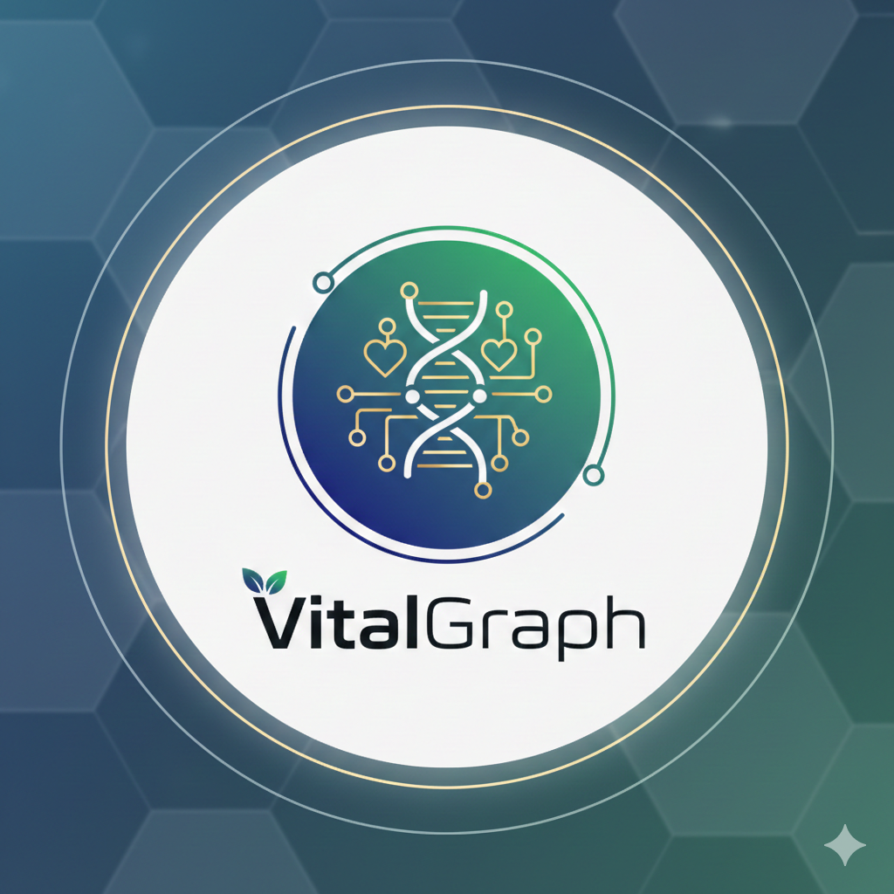
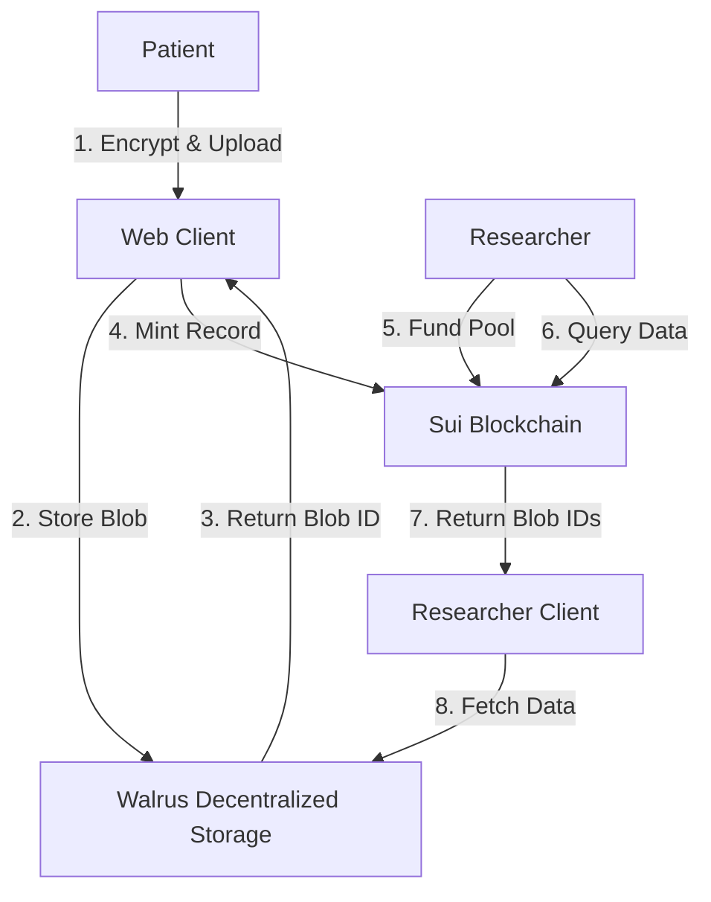
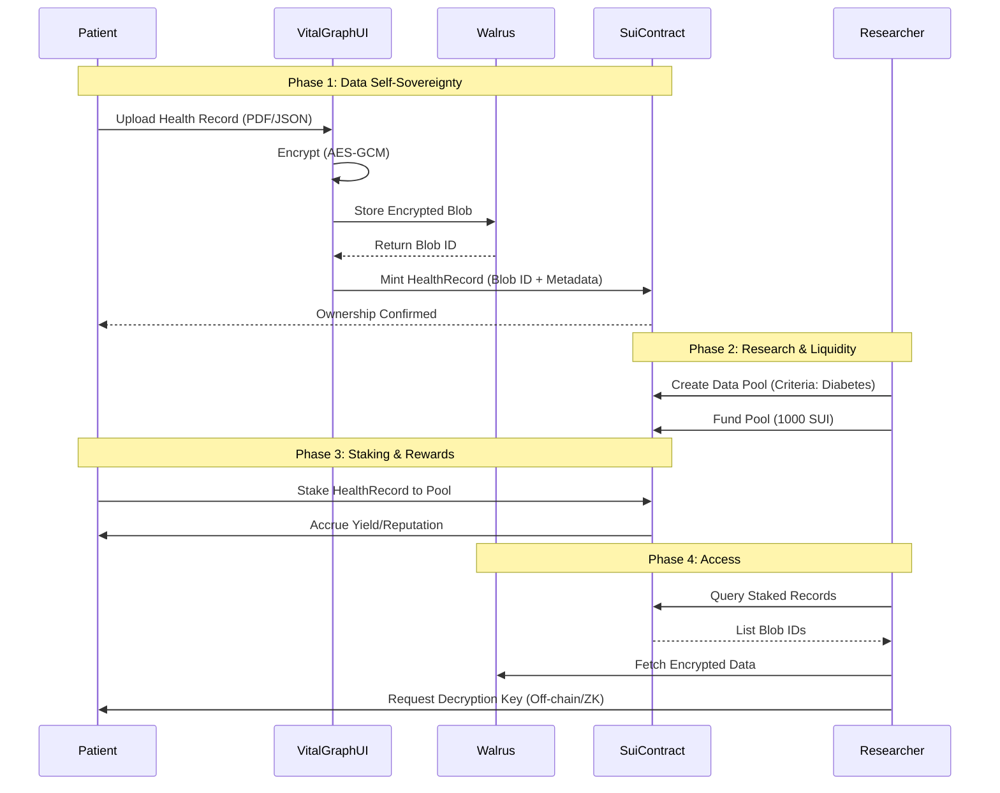

# VitalGraph - DeSci Health Data Marketplace

[](https://vercel.com/)
[](https://v0.app/)
[](https://suiexplorer.com/object/0xf54a608b303446261a1022d9ba53f9e5a30a6fbf8150d320ffae9b095f0c2524)

<div align="center">
  
</div>

## Overview

VitalGraph is a decentralized application (dApp) built on **Sui blockchain** and **Walrus storage** that creates a secure liquidity layer for human health data. It empowers patients to own, encrypt, and monetize their health records (Digital Twin) while providing researchers with verifiable datasets for pharmaceutical and medical studies via data liquidity pools.

## 🌟 Key Features

### 1. **Self-Sovereign Health Identity (Digital Twin)**
- **Mint Digital Twin**: Users mint a unique identity on Sui that anchors their health reputation.
- **Reputation Scoring**: Track participation and data quality verification on-chain.

### 2. **Secure Data Custody**
- **Client-Side Encryption**: All health records are encrypted in the browser before upload using `AES-GCM`.
- **Walrus Decentralized Storage**: Encrypted blobs are stored permanently and censorship-resistantly on Walrus.
- **Verifiable Metadata**: Metadata and encryption IVs are stored on-chain as dynamic fields attached to the Digital Twin.

### 3. **Data Liquidity Pools**
- **Stake Data**: Patients stake their verified health records into disease-specific research pools (e.g., "Type 2 Diabetes", "Cardiovascular Study").
- **Earn Yield**: Participants earn yield/rewards funded by researchers and pharmaceutical companies.
- **Criteria Matching**: Pools enforce specific criteria (e.g., "HbA1c > 7.0%") for high-quality data curation.

### 4. **Researcher Marketplace (DeSci)**
- **Fund Pools**: Researchers deposit SUI, USDC, or stream payments via **x402 Protocol** to incentivize data contribution.
- **Data Explorer**: Discover staked datasets and access them securely.
- **Pay-Per-Access**: Seamless monetization flow for accessing high-value medical datasets.

## 📦 Deployed Contract

**Package ID (Sui Testnet):**
```
0xb07d03d94517ba5bf899199bb01236b6eabacd5d99c9f9178b58003e889b1af1
```

**Explorer Links:**
- [Sui Explorer](https://suiexplorer.com/object/0xb07d03d94517ba5bf899199bb01236b6eabacd5d99c9f9178b58003e889b1af1?network=testnet)
- [Walrus Explorer (Testnet)](https://walrus.space/)

## 🏗️ Architecture

### System Design



### Workflow



### Smart Contracts (Move)

#### `vital_graph::vital_graph`
- **DigitalTwin**: Root object representing the patient.
- **HealthRecord**: Dynamic field attached to the twin containing blob ID and metadata.
- **DataPool**: Shared object for pooling data and liquidity.
- **Functions**:
  - `mint_digital_twin`: Create user identity.
  - `add_health_record`: Store encrypted blob reference.
  - `create_pool`: Initialize new research pool.
  - `stake_record`: Signal participation in a pool.
  - `fund_pool`: Add rewards to a pool.

### Frontend Stack

- **Framework**: Next.js 16 with React 19 (App Router)
- **UI**: Tailwind CSS + Shadcn UI + Framer Motion (Animations)
- **Blockchain**: Sui SDK (@mysten/dapp-kit)
- **Storage**: Walrus HTTP API (Aggregator/Publisher)
- **Security**: Web Crypto API (AES-GCM) for client-side encryption

## 🚀 Getting Started

### Prerequisites

- Node.js 18+ and pnpm
- Sui Wallet Extension (configured for Testnet)

### Installation

```bash
# Install dependencies
pnpm install

# Run development server
pnpm dev

# Build for production
pnpm build
```

### Environment Setup

Ensure your `.env.local` or configuration constants match the deployed package:

```typescript
export const PACKAGE_ID = "0xb07d03d94517ba5bf899199bb01236b6eabacd5d99c9f9178b58003e889b1af1"
```

## 📖 User Journey

### For Patients
1. **Connect Wallet**: Log in with Sui Wallet.
2. **Mint Twin**: Create your on-chain health identity.
3. **Upload Record**: Upload a medical file (PDF/JSON). It is encrypted locally and stored on Walrus.
4. **Stake Data**: Find a relevant Data Pool (e.g., "Rare Disease Research") and stake your record to earn rewards.

### For Researchers
1. **Switch Mode**: Toggle to "Researcher" view in the dashboard.
2. **Create Pool**: Launch a new study with specific data criteria.
3. **Fund Pool**: Deposit liquidity (SUI/USDC) or start a payment stream (x402) to attract participants.
4. **Access Data**: Browse staked records and request access (decryption keys exchanged off-chain or via future ZK integration).

## 🔧 Key Integrations

- **Sui Network**: High-throughput L1 for managing asset ownership and transfers.
- **Walrus**: Decentralized storage for large encrypted health blobs.
- **x402 Protocol**: Experimental payment streaming for continuous data access.

## 📝 License

Copyright (c) VitalGraph Labs.
SPDX-License-Identifier: Apache-2.0

## 🔗 Resources

- [Sui Documentation](https://docs.sui.io/)
- [Walrus Documentation](https://docs.walrus.site/)
- [Mysten dApp Kit](https://sdk.mystenlabs.com/dapp-kit)

---

**Building the Future of Decentralized Science (DeSci)**
